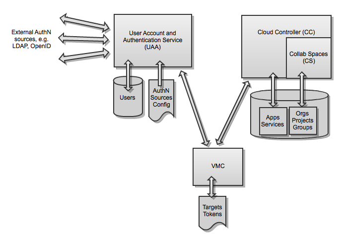
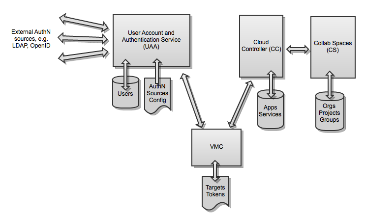
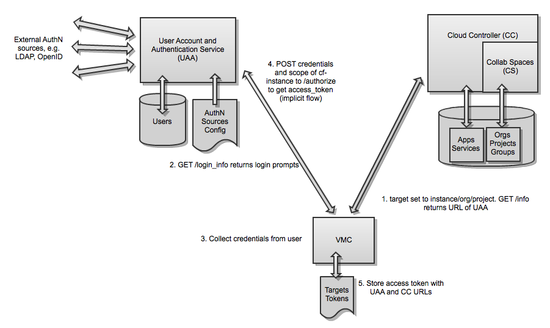
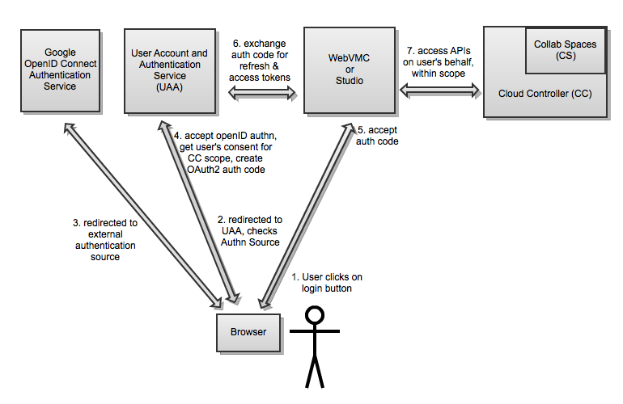
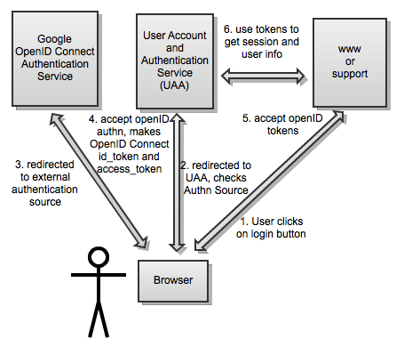

# Interactions Between UAA, CC, CS and VMC

## Introduction

This document describes interactions between 4 components:

1. The [User Account and Authentication Service](#uaa_section) -- a new, separate process accessible via HTTP endpoints.
1. [Collaboration Spaces](#cs_section) -- an initial collaboration spaces module to be included in the cloud controller.
1. [The Cloud Controller](#cc_section) -- what changes would be required to the existing code.
1. [vmc](#vmc_section) -- what changes would be required to existing code.

After discussing each component we walk through a [series of flows](#flows_section) of what happens for a specific set of operations. 

Lastly we will illustrate [flows for web based apps](#web_flows_section).

In the first phase of implementation the collab spaces code is more tightly coupled to the cloud controller and can be illustrated like this:

The second phase of implementation separates the cloud controller and the collab spaces processes and can be illustrated like this:

## <a id="uaa_section"/>User Account and Authentication Service

### Overview

The User Account and Authentication Service (UAA) is:

* A new, separate application from the Cloud Controller
* Owns the user accounts and authentication sources
* Called via REST APIs
* Support for standard protocols to provide single sign-on and delegated authorization to web applications
in addition to REST APIs to support the Cloud Controller and Collaboration Spaces

For more information see the [UAA detailed API documentation](UAA-APIs)

### UAA and OAuth2 Scopes

OAuth2 specifies that access tokens can bound to a set of strings called "scopes" -- the exact content and meaning
of the scope is left to the UAA and any servers that will control access to resources. In some uses the scope is
simply the URL of the resource server. Resource servers should only grant access that is with a scope that has been 
authorized by the user -- which may be a more narrow scope than what the client application requested. 

Initially we will use the scope parameter of OAuth to scope an access_token to a specific cloud foundry instance. The 
UAA and all associated resource servers, e.g. cloud controller, need to agree on scope meanings. In our case, this 
means that a resource server should check that the scope is their own URL. They should not honor access tokens for other scopes. 

## <a id="cs_section"/>Collab Spaces

The [vision document](https://wiki.springsource.com/display/ACDEV/Collaboration+Spaces+Model) for this service contains 
more detail on use cases, requirements, and concepts. There is also a [detailed API document](Collab-Spaces-APIs).

### Overview

* Owns the concepts of orgs, projects with role-maps/ACLs, and groups.
* Handles authorization of authenticated users within the scope of an org and project for access to
resources. 
	* In the case of the cloud controller, these resources are apps and services. However, the design
	is intended to be as general as possible so that it an be used in other cloudfoundry components
	as well.
* Configuration options
	* How to call the UAA endpoint
	* Shared secret for UAA interaction
	* Database configuration
	
### Features

Cloud foundry services want the ability to perform the following types of operations to enable
collaboration spaces.

* Create an Org
* Create Resource (entries) for an Org
* Create projects in an Org
* Create roles in a project
* Assign users to those roles
* Create permission sets for a role. Permission sets are a set of ACLs for resources.

### Initial Authorization System - This will be implemented initially

* Support only for a default project ('all' project).
* Single set of role maps per org
	* Each rolemap row contains a name, set of users, set of permissions/resource pairs.
	* e.g. Users, CRUD to apps, services, apps/\*, services/\*
* Essentially the 'all' project from the collab spaces design. 

## <a id="cc_section"/>Changes to Cloud Controller

### Database changes

* Recognition that the user is operating in an org and project context.

	Each operation needs to recognize its org and project and operate in that context. 
	
* User accounts => orgs

	Orgs will replace users as the owners of apps and services. Therefore the apps and services that
	are currently linked to users will now be linked to orgs. The schema will need to be updated for
	this.
	
* New operation support

	Cloud controller will need to support an info call per org that can return the URL of the UAA for that org.

* User account updates
	
	The collab spaces code will only operate in terms of unique identifiers for users retrieved from the UAA.
	
* Resource (Apps/Services) schema updates
	
	The cloud controller will need to record unique identifiers identifiers for each of these types of 
	resources that are assigned by collab spaces. These identifiers are returned by the collab spaces 
	code when authorization decisions are requested. 

### Code changes

* Authorize an operation

	The cloud controller will need to make calls to the collab spaces code to authorize each
	operation.

* Add authorization filters

* operate on resources based on the resource ID received from the collab spaces code. 
      
### New API endpoints for management of UAA and collab spaces

* Get available authN sources
* Create User, etc.

### Resource Garbage Collection 

There are failure cases where resources can get out of sync between the CC and CS. Need a periodic sync process to clean up dangling references. 

## <a id="vmc_section"/>Changes to VMC

* Add orgs and projects to existing target contexts
	
	vmc may need new options to simplify user's understanding of orgs and projects instead of just appending them to the URL of the cloud foundry instance.
	
* Get UAA endpoint and process dynamic login info 

	vmc needs to be able to get the URL of the UAA for the target org and then request the login info from that UAA. It then needs to handle
	different prompt types to collect the users credentials and then request a token from the UAA. 

* Each token needs to be stored with it's UAA and CFInstance URLs. When changing context to another org or project that 
uses the same UAA and CFInstance URLs, the user does not need to log in again but can continue to use the same token.

<!-- [cc] [org/project] [uaa url] [token] -->

* vmc would also need to communicate the org and project to the user in info call as well as in the call to push so that
the user is aware of the context that is being pushed to.

## <a id="flows_section"/>Flows

Login flow for vmc to cloud controller and collab spaces:

---------
Web sequence diagrams for various operations

1. [vmc target](diagrams/flow-target.png) -- ([text](diagrams/flow-target.txt))
1. [vmc login](diagrams/flow-login.png) -- ([text](diagrams/flow-login.txt))
1. [vmc push app](diagrams/flow-push-app.png) -- ([text](diagrams/flow-push-app.txt))
1. [vmc delete app](diagrams/flow-delete-app.png) -- ([text](diagrams/flow-delete-app.txt))
1. [vmc create org](diagrams/flow-create-org.png) -- ([text](diagrams/flow-create-org.txt))
1. [vmc delete org](diagrams/flow-delete-org.png) -- ([text](diagrams/flow-delete-org.txt))
1. [vmc add role](diagrams/flow-add-role.png) -- ([text](diagrams/flow-add-role.txt))
1. [vmc bind service](diagrams/flow-bind-service.png) -- ([text](diagrams/flow-bind-service.txt))
1. [bosh add stem_cell](diagrams/flow-bosh-add-stem.png) -- ([text](diagrams/flow-bosh-add-stem.txt))

## <a id="web_flows_section"/>Beyond vmc

### Delegated Access to Cloud Controller APIs

[Block diagram](diagrams/delegated-access-to-cc.png)

### SSO to CloudFoundry Support Apps

[Block diagram](diagrams/sso-to-support-apps.png)

## <a id="open_issues_section"/>Open Issues

* New LDAP user -- expect UAA to be able to provide Just In Time provisioning, i.e. create an account as the user authenticates.
* Design database user account migration
* we have now allowed for multiple UAAs per CC/CS, but we should also support multiple CC/CS per UAA -- and should get single 
signon between them. Really need a refresh token. Need to consider OAuth2 authcode flow vs. implicit flow (as Dave has suggested). 
* Need more info on BOSH model. Doesn't need Orgs, but has similar concepts of group/project, object/resource. Bosh 
could actually be an org within a CS instance also used by CC -- though more likely would want the separation of their own instance. 
